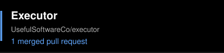
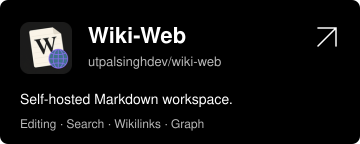

<h1 align="center"><b>Full Stack TypeScript Developer</b></h1>

Utpal Singh · Delhi, India

---

## Contributed to

<b>Merged pull requests</b>

 

**[OpenConcho](https://github.com/offendingcommit/openconcho)**
- [Warn when the Honcho token is missing](https://github.com/offendingcommit/openconcho/pull/103)
- [Link workspace title to its overview](https://github.com/offendingcommit/openconcho/pull/104)
- [Surface workspace deletion errors](https://github.com/offendingcommit/openconcho/pull/105)

**[Executor](https://github.com/UsefulSoftwareCo/executor)**
- [Use the public origin for browser approval URLs](https://github.com/UsefulSoftwareCo/executor/pull/1967)

## Projects

---

## Tech Stack

<b>All skills</b>

 

**Languages**

**Frontend**

**Backend**

**Tools**

